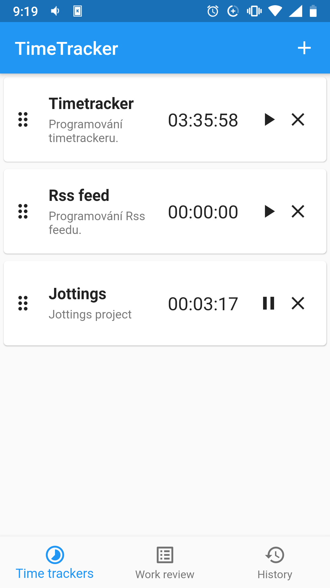
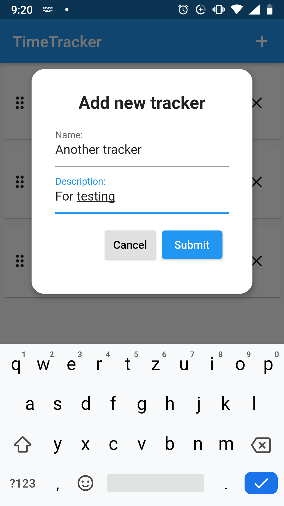
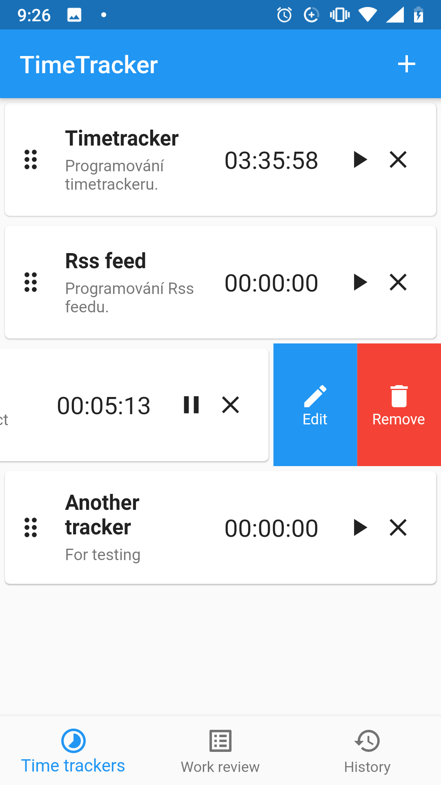

# Timetracker
Flutter application for tracking of time


## Installation

  ```
  git clone https://github.com/mjablecnik/flutter_getx_timetracker
  cd flutter_getx_timetracker
  flutter pub get
  ```
  
## Features
 - Add/Edit/Remove timetracker
 - Start/Stop/Reset timetracker
 - Change position in list of timetrackers


## Special thanks

 - [Dart](https://dart.dev/): client-optimized language for fast apps on any platform.
 - [Flutter](https://flutter.dev/): UI toolkit for building beautiful, natively compiled applications for mobile, web, and desktop from a single codebase.
 - [GetX](https://pub.dev/packages/get): State management, Dependency injection management and Route management in one simple solution.
 - [sqflite](https://pub.dev/packages/sqflite): Great SQlite database plugin for Flutter.


## Screenshots
<table>
  <tr><td>

    </td><td>

    </td><td>

    </td></tr>
</table>


## Contributing
Pull requests are welcome. For major changes, please open an issue first to discuss what you would like to change.


## Author

👤 **Martin Jablečník**

* Website: [martin-jablecnik.cz](https://www.martin-jablecnik.cz)
* Github: [@mjablecnik](https://github.com/mjablecnik)


## Show your support

Give a ⭐️ if this project helped you!

<a href="https://www.patreon.com/mjablecnik">
  
</a>


## 📝 License

Copyright © 2021 [Martin Jablečník](https://github.com/mjablecnik).<br />
This project is [GNU GPLv3](https://choosealicense.com/licenses/gpl-3.0/) licensed.

